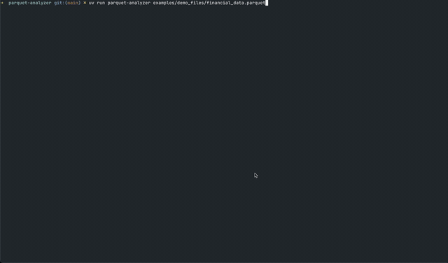

## Linux Kernel

### [Linux Kernel Network Stack Visualization](https://github.com/dmkskd/linux-kernel-network-stack-visualization)

An interactive educational tool that visualizes UDP packet processing through the Linux kernel network stack.

You can open it in your browser here: [linux-kernel-network-stack-visualization](https://dmkskd.github.io/linux-kernel-network-stack-visualization/)

### [Linux Kernel Development Environment on Mac](https://github.com/dmkskd/linux-kernel-debugging-on-mac)

Setup a Linux Kernel development environment on mac arm64 processor.

### [netif_receive](https://github.com/dmkskd/netif-receive)

Re-implementing Brendan Gregg's `bpftrace` networking 1 liner showing the `rx packets distribution per device / cpu using` Rust / Aya.

## Data Engineering

### [Parquet Analyzer](https://github.com/dmkskd/parquet-analyzer)

Interactive TUI for analyzing Parquet file metadata, compression, and optimization.

### [Apache Iceberg Demo](https://github.com/dmkskd/apache-iceberg-demo)

Demonstrates Apache Iceberg's core features through two different demo scripts that showcase ACID operations, schema evolution, time travel, and file structure.visualization.
